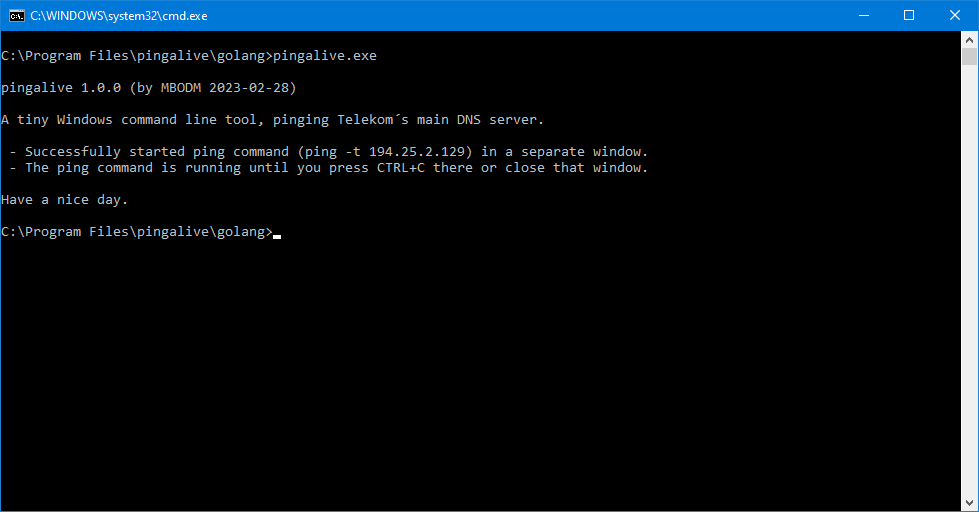

# pingalive-go
A tiny command line tool for Windows, infinitely pinging a specific server (written in Go).

### What it is
- It´s a very tiny (~50 lines of code) command line executable for Windows.
- When executed, it endlessly pings a specific server, until closed.
- It´s used for internet connection testing, for my personal use.

### How it works
- It just executes the Windows `ping.exe` with `-t 194.25.2.129` as parameters.
- The IP address (`194.25.2.129`) is Telekom´s* main DNS server.
- The `ping.exe` process is running standalone, in a separate window.

*Telekom is the largest ISP company in Germany. Their main DNS server is a rather stable and longliving server (since nearly 30 years now). The IP address of that server has never changed (and will never, in my opinion). Therefore i´m using this specific IP address.

### Why it exists
I wasn´t able to successfully add a batch file (`.bat`) or a link (`.lnk`) to the Windows 10 Taskbar. At least not in a way it works properly (maybe i´m just too stupid, but all tries had some issues). So i decided to quickly write a tiny executable doing that job instead. Then i was able to add that executable to the Taskbar, without any problems. That´s the sole reason why this tool exists. :grin:

The reason why this specific version exists, written in Go (the original code is written in Rust), is the simple stupid fact that i just wanted to refresh my Go skills a tiny bit. And this application seems to be the perfect starter project for that.

### Requirements

- 64-bit Windows

There aren´t any other special requirements. The tool is written in Go nd the release binaries are natively compiled with `go build` for the Windows x64 platform, assuming you are using some 64-bit Windows (and that's quite likely).

### Notes
- The tool is written in Go (golang)
- Used Go version is `go 1.20`
- Release binaries are compiled with `go build` on a 64-bit Windows 10 machine
- Used Windows OS version is `Windows 10 Pro 21H2 Build 19044.2486`
- The tool is developed with `VS Code 1.76.0` (with active `Go` extension)
- The tool is using a `cmd.exe /c start ping.exe` approach.
- Approach-Reason1: Text issues with the non-UTF8 Windows console.
- Approach-Reason2: The CTRL+C handling (or the need of `SetConsoleCtrlHandler` Windows calls).
- Approach-Reason3: Way more complexity (maintain child process, stdout, signals).
- And sadly i also forgot what Sean Connery teached us: "_One ping only!_".

The release binaries are compiled with `go build` on the command line, using the following options:
`go build -ldflags="-s -w" -o pingalive.exe`

#### Have fun.
